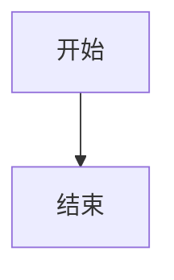

# AGENTS.md - 代理指南

## 项目概述

这是一个基于 **Docsify 的文档站点** - 一个包含 Java、Linux、Windows、AI 等技术主题的 Markdown 笔记知识库。由于本仓库仅包含文档文件，因此没有构建系统、测试或代码检查。

## 仓库结构

```
.agents/skills/          # 代理技能
  web-to-markdown/       # 网页转 Markdown 技能
docs/                    # 文档源文件（Docsify Markdown）
  AI/                    # AI 相关笔记
  Inbox/                 # 收件箱/未整理笔记
  Java/                  # Java 笔记
  Life/                  # 生活笔记
  Linux/                 # Linux/Manjaro 教程
  Windows/               # Windows 教程
  img/                   # 图片
  index.html             # Docsify 入口
  _sidebar.md            # 侧边栏导航
  _navbar.md             # 顶部导航
  _coverpage.md          # 封面页
```

## 构建和开发命令

由于这是纯文档仓库，没有传统的构建/检查/测试命令。

### 本地开发

本地预览文档：

1. **使用 Python 内置 HTTP 服务器：**
   ```bash
   cd docs && python -m http.server 3000
   ```

2. **使用 Node.js http-server：**
   ```bash
   npx http-server docs -p 3000
   ```

3. **使用 Docsify CLI：**
   ```bash
   npx docsify-cli serve docs
   ```

### 单文件测试

没有测试框架。验证 Markdown 文件的方法：
- 检查 YAML frontmatter 有效性（如有）
- 手动预览检查内部链接
- 确保 mermaid 图表语法正确

### 无代码检查

本仓库不使用代码检查工具。编辑 Markdown 时：
- 保持一致的标题层级（h1 → h2 → h3）
- 保持行长度适中以提高可读性
- 使用标准 Markdown 语法

## 代码风格指南

### 文档风格

- **语言：** 内容使用简体中文，除非引用英文技术术语
- **标题：** 使用描述性的中文标题
- **代码块：** 使用带语言标识符的三引号
- **链接：** 内部文档使用相对链接，外部资源使用绝对 URL

### 命名规范

- **文件：** 使用 kebab-case（如 `java-basic-notes.md`、`manjaro-tutorial.md`）
- **文件夹：** 使用小写（如 `docs/Java/`、`docs/Linux/`）
- **图片：** 使用描述性名称（如 `terminal-config-screenshot.png`）

### Markdown 规范

```markdown
# H1 - 页面标题（每个文件一个）

## H2 - 主要章节

### H3 - 子章节

- 使用列表
- 使用 [链接文字](url) 添加链接
- 使用 `代码` 表示行内代码
- 使用 ```语言 添加代码块
```

### Mermaid 图表

添加 mermaid 图表时，使用带语言标识的代码块格式：

<pre>

</pre>

支持的图表类型：`sequenceDiagram`、`graph`、`gantt`、`flowchart`

### 表格

使用正确对齐的 Markdown 表格：

```markdown
| 列 1 | 列 2 | 列 3 |
|----------|----------|----------|
| 内容 | 内容 | 内容 |
```

## 外部资源引用

本项目没有 JavaScript/TypeScript 引用。

在 Markdown 中使用外部资源时：
- 使用可靠的 CDN（jsdelivr、unpkg）
- 尽量使用带版本的 URL
- 示例：`https://cdn.jsdelivr.net/npm/docsify@4/`

## 错误处理

由于没有运行时代码：
- 发现损坏的链接应立即修复
- 缺失的图片应替换或删除
- 无效的 mermaid 语法会渲染为纯文本 - 请手动测试

## 代理技能

### web-to-markdown 技能

本仓库有一个将网页转换为 Markdown 的自定义技能。仅在用户明确要求时使用：

> "use the skill web-to-markdown..."

技能定义在 `.agents/skills/web-to-markdown/SKILL.md`。

**用法：**
```bash
# 将 URL 转换为 Markdown 文件
web2md 'https://example.com/article' --out ./docs/AI/article.md

# 指定 Chrome 路径
web2md 'https://example.com' --chrome-path "C:\Program Files\Google\Chrome\Application\chrome.exe" --out ./out/
```

## 添加新内容

### 步骤 1：选择正确的位置

- **AI/** - 人工智能和机器学习笔记
- **Java/** - Java 相关内容
- **Linux/** - Linux 发行版教程
- **Windows/** - Windows 技巧和教程
- **Inbox/** - 新笔记（待整理）
- **Life/** - 非技术个人笔记

### 步骤 2：创建文件

1. 使用 kebab-case 命名：`descriptive-title.md`
2. 添加有意义的 frontmatter（可选）：
   ```markdown
   ---
   title: 页面标题
   ---
   ```

### 步骤 3：更新导航

编辑 `docs/_sidebar.md` 将新页面添加到侧边栏。

## 常见任务

### 预览更改
```bash
# 简单预览
cd docs && python -m http.server 3000

# 然后在浏览器打开 http://localhost:3000
```

### 检查损坏链接
手动验证链接：
1. 启动本地服务器
2. 在预览中点击每个链接
3. 修复 404 错误

### 添加图片
1. 将图片放入 `docs/img/`
2. 在 Markdown 中引用为 `/img/filename.png`

## 外部资源

- **Docsify 文档：** https://docsify.js.org/
- **Mermaid 图表：** https://mermaid.js.org/
- **Markdown 指南：** https://www.markdownguide.org/

## 代理注意事项

- 与用户交流时必须使用**简体中文**
- 这是一个个人知识库，不是生产应用程序
- 除非明确要求，否则不要修改 Docsify 配置（`docs/index.html`）
- 尊重现有的文件夹结构和命名规范
- 如有疑问，请询问用户
