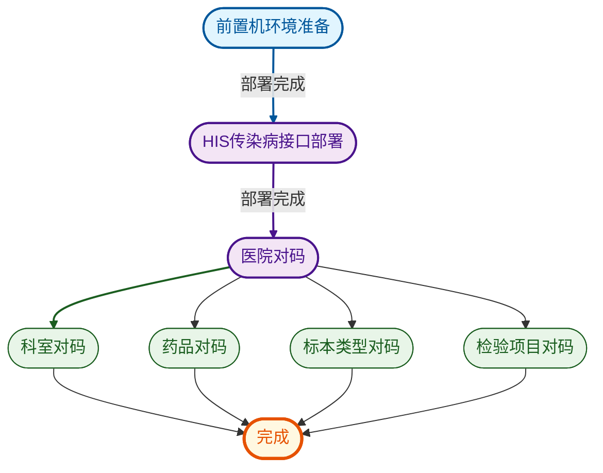

# 1 环境准备
```anyblock
[list2node]
- ## 环境准备
	- 1.传染病机构编码
	- 2.传染病机构名称
	- 3.前置机服务的ip端口
	- 4.传染病机构授权码
```

# 2 对码处理
```anyblock
[list2node]
- ## 对码处理
	- 1.科室对码（**HIS**部门菜单对应医保科别和科室类别）
	- 2.药品对码（**HIS**基本公卫应用/药品对码菜单）
	- 3.标本类型对码（**HIS**控制中心应用/系统字典对码）
	- 4.检验项目对码（**前置机软件**）
```

## 2.1 科室对码
在【部门管理】菜单维护医保科别和科室类别


## 2.2 药品对码
在【基本公卫】应用【传染病药品对码】菜单进行对码


## 2.3 标本类型对码
在【控制中心】应用【系统字典对码】菜单进行对码
第三方系统值和备注都需要填 对应前置机标本类型的编码和含义


第三方传染病标本类型字典如下（该数据来自《国家传染病智能监测预警前置软件数据集成和API 接口规范（试行）-20240730版》值域代码表-30. 标本类别代码）


| 值   | 值含义              |
| --- | ---------------- |
| 01  | 血液               |
| 02  | 血管内导管            |
| 03  | 血管内导管尖端          |
| 04  | 脑脊液              |
| 05  | 脑组织              |
| 06  | 痰                |
| 07  | 肺泡灌洗液            |
| 08  | 经支气管镜防污染保护毛刷获得标本 |
| 09  | 气管抽吸物            |
| 10  | 上呼吸道拭子           |
| 11  | 鼻拭子              |
| 12  | 鼻咽拭子             |
| 13  | 鼻咽部抽吸液           |
| 14  | 鼻咽部洗液            |
| 15  | 喉拭子              |
| 16  | 口腔拭子             |
| 17  | 咽拭子              |
| 18  | 中段尿              |
| 19  | 尿道拭子             |
| 20  | 女性羊膜             |
| 21  | 羊水               |
| 22  | 妊娠产物             |
| 23  | 宫颈拭子             |
| 24  | 后穹窿抽吸液           |
| 25  | 子宫内膜             |
| 26  | 阴道分泌物            |
| 27  | 生殖道损伤            |
| 28  | 前列腺              |
| 29  | 导尿管              |
| 30  | 粪便               |
| 31  | 直肠拭子             |
| 32  | 肛拭子              |
| 33  | 瘘管               |
| 34  | 极速下活检            |
| 35  | 胃镜下活检            |
| 36  | 脓肿               |
| 37  | 脓肿组织             |
| 38  | 脓肿液体             |
| 39  | 脓肿拭子             |
| 40  | 咬伤               |
| 41  | 咬伤伤口组织           |
| 42  | 咬伤伤口液体           |
| 43  | 咬伤伤口拭子           |
| 44  | 伤口               |
| 45  | 伤口分泌物            |
| 46  | 伤口组织             |
| 47  | 骨髓               |
| 48  | 骨骼               |
| 49  | 皮肤               |
| 50  | 皮肤-烧伤疮面          |
| 51  | 皮肤-烧伤疮面拭子        |
| 52  | 压疮溃疡             |
| 53  | 牙龈               |
| 54  | 牙周               |
| 55  | 根尖周              |
| 56  | 内耳标本             |
| 57  | 外耳拭子             |
| 58  | 结膜拭子             |
| 59  | 角膜刮擦             |
| 60  | 前房水              |
| 61  | 玻璃体              |
| 62  | 胸水               |
| 63  | 腹水               |
| 64  | 心包液              |
| 65  | 关节液              |
| 66  | 胆汁               |
| 67  | 坏疽组织             |
| 68  | 头发               |
| 69  | 指甲               |
| 70  | 活体组织             |
| 99  | 其他               |
## 2.4 检验项目对码
联系售后导出his的所有检验项目明细，在前置机中进行对码


> [!note]
> 注：若没有对应的功能菜单，联系实施指导配置一下


# 3 验证完成
对码完成后，医生下传染病诊断后，可以在前置机上看到对应的传染病患者信息


>[!note]
> 如果前置机没有提示，可能是由于缺少传染病对照关系,需要在**基本公卫**/**报卡对照**菜单中完善
> 

